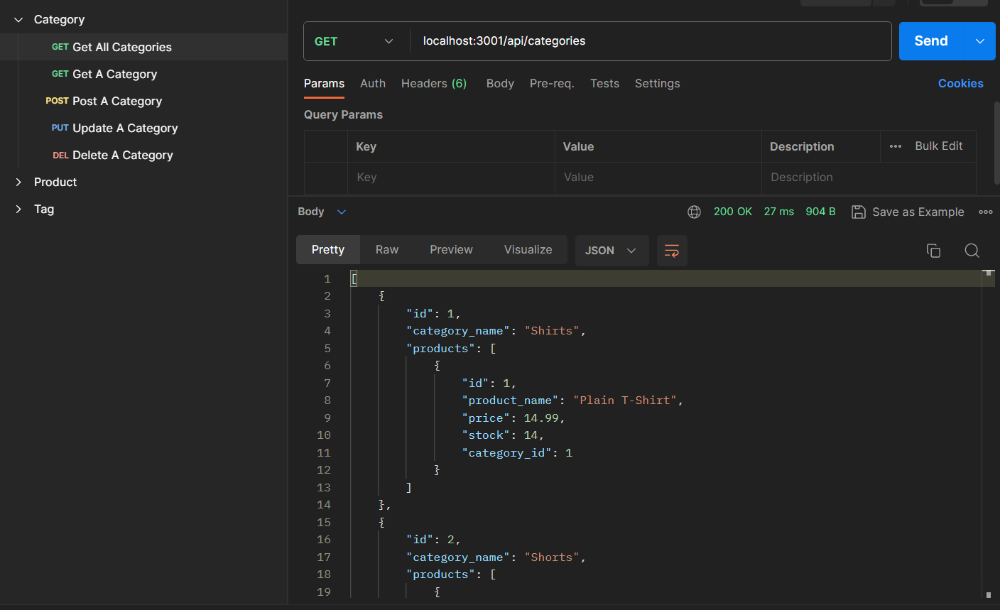
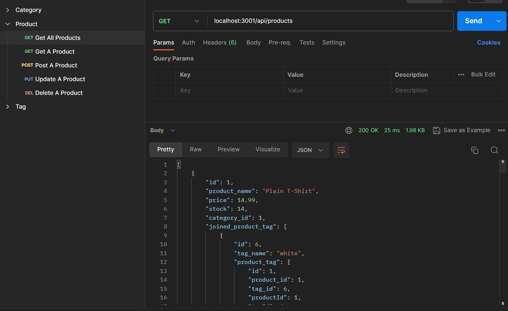
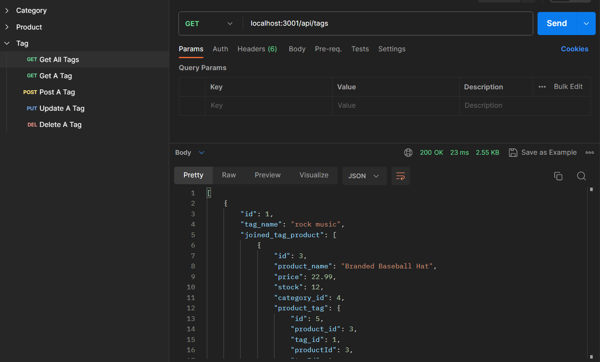

# eCommerce-backend


Walk-through Video: https://watch.screencastify.com/v/x3xJLphKygJp6bzhcQmX

## Description

In this project, the backend and core framework has been established for an e-commerce platform. Details pertaining to products, categories, and tags are stored in correlated tables within a MySQL database. Users have the capability to access the desired information, as well as create, modify, or remove information based on their demand.

## Table of Contents

* [Installation](#Installation)

* [Technology](#technology)

* [Usage](#usage)

* [License](#license)

* [Contributing](#contributing)

* [Tests](#tests)

* [Questions](#questions)


## Installation

To install dependencies, run these commands:

```
npm install
```

## Technology
Technology used:
- node.js
- Express.js API
- Sequelize 
- MySQL database

## Usage
- User can GET all categories, Get one category, POST a category, PUT a category and DELETE a category in Category model.



- User can GET all products, Get one product, POST a product, PUT a product and DELETE a product in Product model.


- User can GET all tags, Get one tag, POST a tag, PUT a tag and DELETE a tag in Tag model.


## License

      Copyright © MIT. All rights reserved. 
      
      Licensed under the MIT license.


## Contributing
To make this project better, please fork the repo and create a pull request. You can also simply open an issue with the tag "enhancement".

* Fork the Project
* Create your Feature Branch (git checkout -b feature/AmazingFeature)
* Commit your Changes (git commit -m 'Add some AmazingFeature')
* Push to the Branch (git push origin feature/AmazingFeature)
* Open a Pull Request

## Tests

To run tests, run these commands:

```
npm run test
```

## Questions
This project is contributed by [yul402](https://github.com/yul402/)

Contact infotmation: Ying.li20@outlook.com
